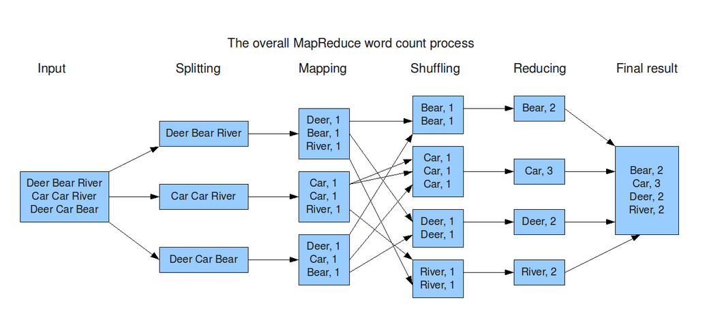

Hadoop
============= 

> Hadoop = 대규모 비정형 데이터 세트를 분산 저장 및 처리할 수 있는 오픈소스 프레임워크 / 병렬 처리

1. window에서 WSL/ 터미널 먼저 설치 필요
```
wsl --install
```
*username/password = ubunto(오타)

2. git bash를 터미널에서 실행시키기 위한 코드
터미널 설정 > Json 파일열기 > git bash profile 터미널에 추가
```
{
    "name": "Git Bash",
    "commandline": "C:\\Program Files\\Git\\bin\\bash.exe -li",
    "icon": "C:\\Program Files\\Git\\mingw64\\share\\git\\git-for-windows.ico",
    "startingDirectory": "%USERPROFILE%"
}
```
3. 리눅스 설정(LINUx)
** window
- `sudo apt-get update`
- `sudo apt-get install openjdk-8-jdk`
    - java -version 으로 확인
- vi ~/.bashrc
    - `export JAVA_HOME=/usr/lib/jvm/java-8-openjdk-amd64`
- `sudo apt-get install openssh-server`
    - `sudo ufw allow 22`
    - 키생성
        - `ssh-keygen -t rsa -P '' -f ~/.ssh/id_rsa`
    - 키등록
        - `cat ~/.ssh/id_rsa.pub >> ~/.ssh/authorized_keys`
        - `chmod 600 ~/.ssh/authorized_keys`

4. hadoop 설치
    - `wget https://dlcdn.apache.org/hadoop/common/hadoop-3.3.6/hadoop-3.3.6.tar.gz`
    - `tar zxvf hadoop-3.3.6.tar.gz`
    
    ```bash
    # .bashrc
    export HADOOP_HOME=/home/ubuntu/hadoop-3.3.6
    export PATH=$PATH:$HADOOP_HOME/bin
    ```
    
    - source .bashrc
        - hadoop version

5. hadoop 실행을 위해 코드 수정
- core-site.xml
```
<configuration>
    <property>
        <name>fs.defaultFS</name>
        <value>hdfs://localhost:9000</value>
    </property>
</configuration>
```

- 터미널(dfs폴더/data, name 파일 생성)
```
mkdir -p dfs/data
mkdir -p dfs/name
```

- hdfs-site.xml
```
<configuration>
    <property>
        <name>dfs.replication</name>
        <value>1</value>
    </property>
    <property>
        <name>dfs.namenode.name.dir</name>
        <value>/home/ubunto(경로확인필요)/hadoop-3.3.6/dfs/name</value>
    </property>
    <property>
        <name>dfs.datanode.data.dir</name>
        <value>/home/ubunto(경로확인필요)/hadoop-3.3.6/dfs/data</value>
    </property>
</configuration>
```
- mapred-site.xml
```
<configuration>
    <property>
        <name>mapreduce.framework.name</name>
        <value>yarn</value>
    </property>
    <property>
        <name>mapreduce.application.classpath</name>
        <value>$HADOOP_MAPRED_HOME/share/hadoop/mapreduce/*:$HADOOP_MAPRED_HOME/share/hadoop/mapreduce/lib/*</value>
    </property>
</configuration>
```
- yarn-site.xml
```
<configuration>
    <property>
        <name>yarn.nodemanager.aux-services</name>
        <value>mapreduce_shuffle</value>
    </property>
    <property>
        <name>yarn.nodemanager.env-whitelist</name>
        <value>JAVA_HOME,HADOOP_COMMON_HOME,HADOOP_HDFS_HOME,HADOOP_CONF_DIR,CLASSPATH_PREPEND_DISTCACHE,HADOOP_YARN_HOME,HADOOP_HOME,PATH,LANG,TZ,HADOOP_MAPRED_HOME</value>
    </property>
</configuration>
```
- hadoop-env.sh
```
export JAVA_HOME=/usr/lib/jvm/java-8-openjdk-amd64
```
6. 네임노드 포맷
```
hdfs namenode -format
```
dfs/name/ 새로운 파일들 생성됨

7. hfds 실행 **localhost:9870
```
sbin/start-dfs.sh
```

8. yarn 실행 **localhost:8088
```
sbin/start-yarn.sh
```
9. 실행 중지
```
sbin/stop-dfs.sh
sbin/stop-yarn.sh
```
10. 예제 코드
```
hadoop jar $HADOOP_HOME/share/hadoop/mapreduce/hadoop-mapreduce-examples-3.3.6.jar pi 10 10000
```
-> pi 값 계산하는 코드 실행


Mapreduce
============= 
> 

```
dataset > 대용량 파일

*가져오는 방법 : wget 링크
*zip 해제: unzip
*hadoop으로 이동: hdfs dfs -put input(이름)
```

1. mapper.py
```
예시)
import sys

for line in sys.stdin:
    line = line.strip()
    words = line.split()

    for word in words:
        print(f'{word}\t1')
```
```
에시2 - 정규표현식 이용)
import sys
import re # 정규표현식 사용하기 위한 코드 삽입

time_pattern = re.compile(r':(\d{2}):(\d{2}):(\d{2})')

# fstring 대신 r''사용
# \d = 숫자
# {2} = 두 자리
# email 정규표현식 예시 = '^[a-zA-Z0-9+-\_.]+@[a-zA-Z0-9-]+\.[a-zA-Z0-9-.]+$'

for line in sys.stdin:
    line = line.strip()
    # line.split(':')[1]

    match = time_pattern.search(line)

    if match:
        hour = match.group(1)
        print(f'{hour}\t1')
```

2. reducer.py
```
예시)
import sys

last_word = None
total_count = 0

for line in sys.stdin:
    line = line.strip()

    word, value = line.split('\t')
    value = int(value)

    if last_word == word:
        total_count += value
    else:
        if last_word is not None:
            print(f'{last_word}\t{total_count}')
        last_word = word
        total_count = value

if last_word == word:
    print(f'{last_word}\t{total_count}')
```

3. linux환경에서 실행
```
cat (파일 이름) | python3 mapper.py | sort | python3 reducer.py
```


4. hadoop에서 실행
```
hadoop jar ~/hadoop-3.3.6/share/hadoop/tools/lib/hadoop-streaming-3.3.6.jar \
-input /user/ubunto(오타)/input/파일이름 \
-output /user/ubunto(오타)/output/이름(생성) \
-mapper 'python3 /home/ubunto(오타)/dmf/hadoop/폴더이름/mapper.py' \
-reducer 'python3 /home/ubunto(오타)/dmf/hadoop/폴더이름/reducer.py'
```
-> 결과 확인 localhost:9870 output 
